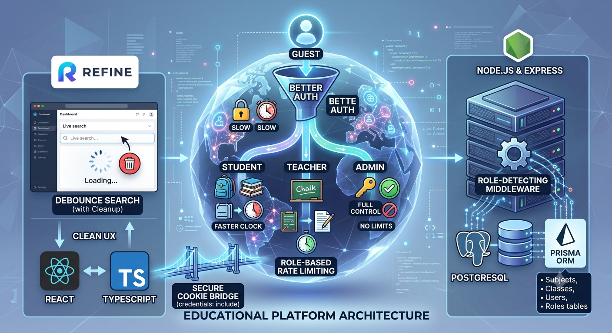

<p align="center">
  
</p>

# ⚙️ Educational Management Platform - Backend

A robust, scalable, and secure RESTful API built with **Node.js** and **Express**. This backend application serves as the core engine for the educational platform, managing business logic, relational data persistence via **Prisma ORM & PostgreSQL**, identity validation through **Better Auth**, and sophisticated traffic control using custom **Role-Based Rate Limiting Middleware**.

---

## 🚀 Key Features

* **Identity & Session Management:** Integrated with **Better Auth** to provide highly secure, cookie-based session verification. Supports complex multi-tenant or role-specific access patterns.
* **Role-Based Rate Limiting (Middleware):** Custom-built security middleware that intercepts incoming requests, interrogates the active session token, and applies strict dynamic rate limits based on user roles:
  * 🔒 **Guest:** `20 Requests / Min` (Protects authentication routes from brute-force/credential stuffing).
  * 🧑‍🎓 **Student:** `60 - 80 Requests / Min` (Optimized for active, natural student reading and searching).
  * 👨‍🏫 **Teacher:** `120 Requests / Min` (Higher capacity to allow bulk grading, resource scheduling, and administrative operations).
* **Database Layer & Type Safety:** Implements **PostgreSQL** for strict relational data consistency. Managed exclusively through **Prisma ORM**, enabling seamless migrations, declarative schema design, and fully-typed queries.
* **CORS & Secure Cookie Pathing:** Explicitly configured CORS policy to handshake exclusively with trusted frontend clients, requiring `credentials: true` to prevent Cross-Site Request Forgery (CSRF).
* **Comprehensive Educational Schema:** Designed with relational tables managing interrelated domains: `Users`, `Roles`, `Subjects`, `Classes`, and `Schedules`.

## 🛠️ Tech Stack

* **Runtime:** Node.js (v18+)
* **Framework:** Express.js
* **ORM:** Prisma ORM
* **Database:** PostgreSQL
* **Authentication:** Better Auth

## 📁 Project Structure

```text
src/
├── config/          # Configurations (Prisma Client, Better Auth server init)
├── controllers/     # Route handlers processing business logic (Subjects, Users, etc.)
├── middleware/      # Custom middlewares (authGate, roleRateLimiter, errorWatcher)
├── routes/          # Express API route mapping definitions
├── schema/          # Prisma schema or structural validation mapping
└── app.ts           # App setup, CORS configuration, and middleware orchestration
